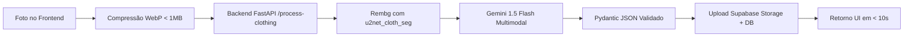

# 03. AI Clothing Pipeline (Rembg + Google Gemini Gratuito)

Esta skill detalha a orquestração do pipeline de processamento de imagens a **custo zero** e sem necessidade de cartão de crédito, combinando a biblioteca open source `rembg` e a API gratuita do **Google Gemini (Gemini 1.5 Flash)** via Google AI Studio.

---

## 1. Visão Geral do Pipeline (Custo $0,00)



---

## 2. Remoção de Fundo com `rembg`

Utilizamos o modelo `u2net_cloth_seg`, especializado em isolar peças de roupas e desconsiderar cabides, camas ou fundos irregulares:

- Executado localmente no backend Python via `onnxruntime`.
- Custo por foto: **R$ 0,00 / US$ 0,00**.
- Tempo médio de processamento: 1.2s a 2.5s.

Consulte o código completo do serviço em [rembg-pipeline.md](./references/rembg-pipeline.md).

---

## 3. Categorização Visual com Google Gemini 1.5 Flash

A foto (com ou sem fundo) é submetida ao **Gemini 1.5 Flash** utilizando o recurso de **Structured Outputs** (Pydantic / JSON Schema) garantindo que a resposta nunca quebre e contenha exatamente os campos necessários.

### Código de Exemplo (`backend/app/services/gemini_classifier.py`):

```python
import os
from google import genai
from google.genai import types
from pydantic import BaseModel, Field
from typing import List, Literal
from PIL import Image

class PecaClassificada(BaseModel):
    nome_sugerido: str = Field(description="Nome curto e elegante da peça de roupa")
    categoria: Literal['superior', 'inferior', 'corpo_inteiro', 'sobreposicao', 'calcado', 'acessorio']
    subcategoria: str = Field(description="Ex: camiseta, calca_jeans, tenis, saia, blazer")
    cor_primaria: str = Field(description="Cor dominante simples em português (ex: preto, branco, azul marinho, bege)")
    cores_secundarias: List[str] = Field(default_factory=list, description="Outras cores ou detalhes")
    estacao: Literal['verao', 'inverno', 'meia_estacao', 'todas']
    ocasiao_recomendada: Literal['casual', 'trabalho', 'festa', 'esporte']
    estilo: str = Field(description="Ex: minimalista, casual, elegante, streetwear")
    padrao_estampa: Literal['lisa', 'listrada', 'xadrez', 'floral', 'estampada', 'grafica']

client = genai.Client(api_key=os.getenv("GEMINI_API_KEY"))

def classificar_roupa_com_gemini(imagem_pil: Image.Image) -> PecaClassificada:
    prompt = (
        "Você é um especialista em moda sustentável para o aplicativo Guarda-Roupa Consciente (ODS 12). "
        "Analise a imagem da peça de vestuário e classifique seus atributos com máxima precisão."
    )

    response = client.models.generate_content(
        model='gemini-1.5-flash',
        contents=[imagem_pil, prompt],
        config=types.GenerateContentConfig(
            response_mime_type="application/json",
            response_schema=PecaClassificada,
            temperature=0.1
        ),
    )

    # O Gemini devolve o JSON perfeitamente formatado
    return PecaClassificada.model_validate_json(response.text)
```

Consulte o schema em [vision-prompt-schema.json](./references/vision-prompt-schema.json).

---

## 4. Orquestrador FastAPI (`backend/app/main.py`)

O backend recebe a foto do cliente via POST multipart, executa o corte de fundo e a classificação em uma única rota atômica:

```python
from fastapi import FastAPI, UploadFile, File, Form, HTTPException
from fastapi.middleware.cors import CORSMiddleware
from PIL import Image
import io
import base64
from app.services.bg_remover import remover_fundo_roupa
from app.services.gemini_classifier import classificar_roupa_com_gemini

app = FastAPI(title="Guarda-Roupa Consciente AI API")

app.add_middleware(
    CORSMiddleware,
    allow_origins=["*"], # Ajustar em produção
    allow_credentials=True,
    allow_methods=["*"],
    allow_headers=["*"],
)

@app.post("/api/process-clothing")
async def process_clothing(file: UploadFile = File(...)):
    try:
        contents = await file.read()
        image_original = Image.open(io.BytesIO(contents)).convert("RGB")
        
        # 1. Remoção de Fundo
        image_nobg = remover_fundo_roupa(image_original)
        
        # 2. Classificação com Gemini 1.5 Flash
        classificacao = classificar_roupa_com_gemini(image_nobg)
        
        # 3. Converter imagem sem fundo para base64 para envio rápido ao frontend
        buffered = io.BytesIO()
        image_nobg.save(buffered, format="PNG")
        nobg_base64 = base64.b64encode(buffered.getvalue()).decode("utf-8")
        
        return {
            "success": True,
            "metadata": classificacao.model_dump(),
            "image_nobg_base64": f"data:image/png;base64,{nobg_base64}"
        }
    except Exception as e:
        raise HTTPException(status_code=500, detail=str(e))
```

---

## 5. Checklist de Verificação

- [ ] `GEMINI_API_KEY` configurada no `.env` do backend.
- [ ] Remoção de fundo testada com `u2net_cloth_seg`.
- [ ] Retorno da categorização no schema tipado sem erros de parse JSON.
- [ ] Tempo total de resposta ponta a ponta abaixo de 10 segundos.
