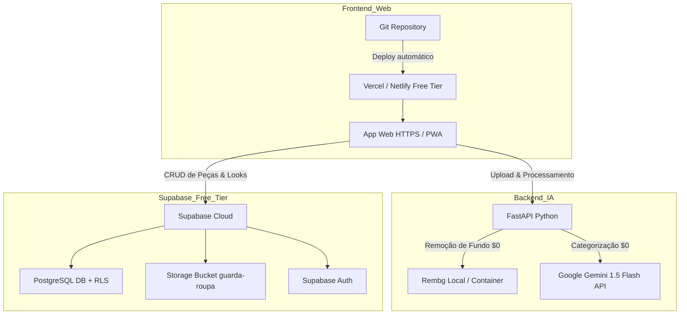

# 06. Deploy, CI/CD & Homologação (Stack Gratuita)

Esta skill orienta o processo de deploy da aplicação completa (Frontend Web PWA + Backend FastAPI + Supabase Cloud Free Tier) e a validação prática dos critérios de sucesso do PRD com custo zero.

---

## 1. Arquitetura de Deploy (Custo Zero)

---

## 2. Passo a Passo de Deploy e Execução

Consulte o checklist detalhado em [deploy-checklist.md](./references/deploy-checklist.md).

### Etapa 1: Supabase Cloud (Free Tier)
1. Crie o projeto gratuito em [database.new](https://database.new).
2. No **SQL Editor**, execute em sequência:
   - `02-supabase-data-layer/references/schema.sql`
   - `02-supabase-data-layer/references/rls-policies.sql`
3. Copie a `Project URL` e a chave pública `anon`.

### Etapa 2: Deploy do Frontend (Vercel / Netlify)
1. Conecte o repositório GitHub na Vercel.
2. Defina o Root Directory como `frontend` (ou raiz).
3. Configure as variáveis de ambiente:
   - `VITE_SUPABASE_URL` = URL do Supabase
   - `VITE_SUPABASE_ANON_KEY` = Anon Public Key
   - `VITE_API_URL` = URL do backend FastAPI (ex: Render Free ou túnel ngrok no teste piloto)
4. Execute o build (`npm run build`).

### Etapa 3: Execução do Backend FastAPI (Opções Gratuitas)
- **Opção A (Testes Piloto com Usuários Reais):** Rodar localmente na máquina com túnel seguro HTTPS (`ngrok http 8000` ou `localtunnel --port 8000`).
- **Opção B (Hospedagem Cloud Gratuita):** Render Web Service (Free Tier) ou Hugging Face Spaces (Docker/Python).

---

## 3. Validação dos Critérios de Sucesso do PRD (ODS 12)

Após o deploy, realize a checagem com o grupo piloto:

| # | Critério de Sucesso do PRD | Como Validar no Ambiente de Produção | Status |
|---|---|---|---|
| 1 | **Cadastro < 30 segundos** | Cronometrar da foto até a confirmação da peça na grade | [ ] Validado |
| 2 | **Categorização automática** | Checar se o Gemini 1.5 Flash classificou tipo, cor e estação com precisão | [ ] Validado |
| 3 | **Sugestão de combinação** | Gerar looks na aba *Gerador* exclusivamente com peças já cadastradas | [ ] Validado |
| 4 | **Validação qualitativa ODS 12** | Coletar relato se a ferramenta evitou compra impulsiva de roupa nova | [ ] Validado |

---

## 4. Checklist de Segurança Pré-Lançamento

- [ ] `GEMINI_API_KEY` segura no backend (nunca exposta no frontend).
- [ ] RLS ativo em todas as tabelas no Supabase (isolamento total entre usuários).
- [ ] PWA instalado e testado no smartphone dos usuários piloto.
