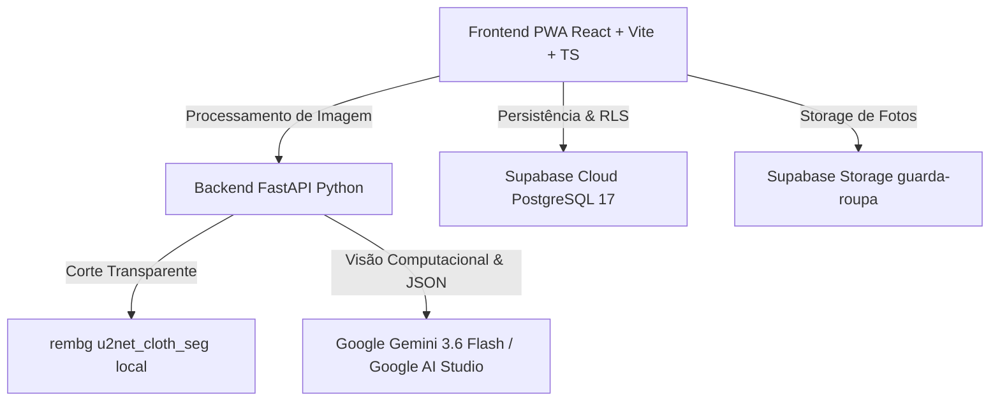

# 🌱 Guarda-Roupa Consciente
> **Aplicativo de Gestão Inteligente de Roupas, Redução do Desperdício Têxtil e Moda Sustentável**  
> *Projeto desenvolvido para a **Atividade Extensionista 4 (Gran Faculdade)** — Vinculado ao **ODS 12 (Consumo e Produção Responsáveis)** da ONU.*

---

## 🎯 Propósito e Alinhamento ao ODS 12 (Meta 12.2)

O setor têxtil global é um dos maiores consumidores de água doce e emissores de carbono do planeta. Grande parte do consumo desenfreado de *"fast fashion"* acontece simplesmente porque as pessoas **esquecem o que já têm guardado no armário** e têm dificuldade de combinar peças existentes.

O **Guarda-Roupa Consciente** resolve isso através de tecnologia acessível:
- 📸 **Cadastro Rápido (<30s):** Fotografe qualquer peça; nossa IA remove o fundo e classifica tipo, cor, estação e estilo automaticamente.
- 🎨 **Motor de Combinações Inteligentes (Outfit Engine):** Sugere looks novos usando harmonia cromática e **priorizando intencionalmente as peças menos usadas do guarda-roupa**.
- 💧 **Métricas de Impacto Ambiental:** Painel em tempo real que estima os litros de água poupados ao evitar compras impulsivas e estimula a meta de reuso consciente.

---

## 🛠️ Arquitetura e Tecnologias (100% Gratuitas)



- **Frontend:** React 18, TypeScript, Vite, TailwindCSS / CSS Glassmorphism, Lucide Icons, Canvas Confetti.
- **Backend:** FastAPI (Python 3.9+), Uvicorn, Pillow, `rembg` (ONNX Runtime).
- **Inteligência Artificial:** Google Gemini (Gemini 3.6 Flash / Multimodal) com Structured JSON Outputs via Google AI Studio (**Zero Custo / Sem Cartão de Crédito**).
- **Banco de Dados & Storage:** Supabase Cloud (PostgreSQL 17 com Row Level Security e Storage Bucket privado).

---

## 📱 Funcionalidades Principais (MVP)

1. **F1 - Cadastro Ultrarrápido (<30s):** Envio com câmera ou galeria, corte automático do fundo e preenchimento de metadados por IA.
2. **F2 - Grade do Guarda-Roupa:** Visualização em cartões, filtros por categoria (*Superior, Inferior, Calçados, Casacos*), busca instantânea e contador de uso.
3. **F3 - Gerador de Combinações:** Algoritmo determinístico baseado em teoria de cores (análogas, complementares, monocromáticas, neutras) que resgata peças esquecidas.
4. **F4 - Looks Salvos & Histórico:** Favoritar combinações preferidas e registrar quando um look completo foi vestido.
5. **Painel de Sustentabilidade ODS 12:** Gráfico de rotação do armário e economia hídrica estimada.

---

## 🚀 Como Executar Localmente

### 1. Pré-requisitos
- Node.js 18+ instalado
- Python 3.9+ instalado
- Chaves gratuitas do Supabase e Google AI Studio

### 2. Configurar Variáveis de Ambiente
Copie o arquivo `.env.example` para `.env` na raiz e preencha suas credenciais:
```bash
cp .env.example .env
```

### 3. Iniciar o Backend (FastAPI + IA)
```bash
cd backend
python3 -m venv venv
source venv/bin/activate
pip install -r requirements.txt
uvicorn app.main:app --reload --port 8000
```

### 4. Iniciar o Frontend (React + Vite)
```bash
cd frontend
npm install
npm run dev
```
Acesse no seu navegador: **`http://localhost:5173/`**

---

## ☁️ Deploy na Vercel

1. Suba este repositório para o seu **GitHub**.
2. Acesse [vercel.com](https://vercel.com) e clique em **"Add New Project"**.
3. Importe o repositório `guarda-roupa-consciente`.
4. Configure as variáveis de ambiente na Vercel:
   - `VITE_SUPABASE_URL`: sua URL do Supabase.
   - `VITE_SUPABASE_ANON_KEY`: sua anon key do Supabase.
   - `VITE_API_URL`: URL da sua API ou `http://localhost:8000`.
5. Clique em **Deploy**!

---

## 📄 Licença e Autoria
Desenvolvido por **Lohan Faria Coelho** para a **Atividade Extensionista 4 — Gran Faculdade**.  
Distribuído sob a licença MIT.
