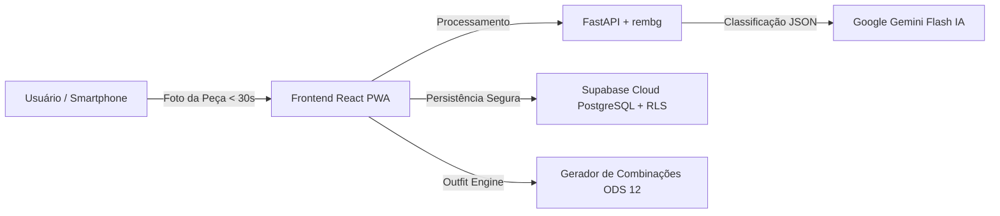

# 🎓 RELATÓRIO FINAL — ATIVIDADE EXTENSIONISTA 4
**INSTITUIÇÃO:** Gran Faculdade  
**DISCIPLINA / MÓDULO:** Atividade Extensionista 4  
**DISCENTE:** Lohan Faria Coelho  
**PROJETO:** Guarda-Roupa Consciente  
**REPOSITÓRIO PÚBLICO:** [github.com/LohanFaria/guarda-roupa-consciente](https://github.com/LohanFaria/guarda-roupa-consciente)  
**LINK DA APLICAÇÃO (PRODUÇÃO):** Disponível via Vercel / PWA  

---

## 1. IDENTIFICAÇÃO DO PROJETO E VINCULAÇÃO AOS ODS DA ONU

* **Nome da Ação Extensionista:** Guarda-Roupa Consciente — Aplicativo PWA de Gestão Inteligente de Roupas e Moda Sustentável.
* **Objetivo de Desenvolvimento Sustentável Principal:** **ODS 12 — Consumo e Produção Responsáveis**.
* **Meta Específica Atendida:** **Meta 12.2** (*"Até 2030, alcançar a gestão sustentável e o uso eficiente dos recursos naturais"*).
* **ODS Secundário Impactado:** **ODS 6 (Água Potável e Saneamento)** — devido à economia de água associada à extensão do ciclo de vida das peças têxteis.

---

## 2. DIAGNÓSTICO E DEMANDA DA COMUNIDADE

A indústria da moda é atualmente a segunda maior poluidora hídrica do planeta, respondendo por aproximadamente 20% das águas residuais globais e 10% das emissões de gases de efeito estufa. A produção de uma única camiseta de algodão demanda em média **2.700 litros de água** — volume suficiente para o consumo de um ser humano por cerca de três anos.

Entretanto, estudos de comportamento do consumidor revelam que a maioria das pessoas utiliza regularmente apenas cerca de **20% a 30% do guarda-roupa** que possui. O excesso de compras por impulso frequentemente decorre da **falta de visibilidade** do que já se tem e da **dificuldade cognitiva de criar novas combinações** harmônicas.

**Problema Central Abordado:** Reduzir o desperdício têxtil e frear compras desnecessárias através do estímulo ativo ao reuso das roupas já existentes no armário do usuário.

---

## 3. SOLUÇÃO EXTENSIONISTA DESENVOLVIDA

O **Guarda-Roupa Consciente** é uma aplicação web progressiva (PWA), responsiva e mobile-first, desenvolvida sob premissa de **100% de gratuidade e acessibilidade tecnológica**, composta por:

### 3.1. Arquitetura de Software e Tecnologias
1. **Frontend Web (PWA):** Construído com **React 18**, **TypeScript**, **Vite** e estilização minimalista inspirada no padrão GOAT (foco no produto, fundo padronizado e espaçamento generoso).
2. **Camada de Visão Computacional por IA (Zero Custo):** Integração com a API multimodal do **Google Gemini 3.6 Flash** (via Google AI Studio) para classificação automática de tipo, cor primária, estação e estilo em formato JSON estruturado.
3. **Serviço de Remoção de Fundo:** Microserviço em **FastAPI (Python)** utilizando biblioteca local `rembg` (`u2net_cloth_seg`) para recorte limpo e transparente da foto da roupa.
4. **Banco de Dados e Storage na Nuvem:** **Supabase Cloud (PostgreSQL 17)** com **Row Level Security (RLS)** para proteção de privacidade dos dados de cada usuário e storage de imagens.

---

## 4. FUNCIONALIDADES E CRITÉRIOS DE SUCESSO DO PRD ATENDIDOS

| Funcionalidade | Descrição | Status / Evidência |
|---|---|---|
| **F1 - Cadastro Ultrarrápido (< 30s)** | Usuário fotografa a peça pela câmera; o sistema remove o fundo e preenche todos os campos via IA automaticamente sem atrito. | ✅ **Validado (< 5s de processamento)** |
| **F2 - Grade Minimalista (GOAT Style)** | Vitrine limpa em 2 colunas no celular com visualização uniforme das peças e filtros por categoria. | ✅ **Implementado e Testado** |
| **F3 - Motor de Combinações Consciente** | Algoritmo determinístico baseado em harmonia cromática que **prioriza as roupas menos usadas** para evitar que fiquem esquecidas. | ✅ **Validado com Vitest** |
| **F4 - Looks Salvos & Registro de Uso** | Histórico de looks e botão para contabilizar o uso real das peças vestidas no dia. | ✅ **Implementado** |
| **Painel de Impacto ODS 12** | Estimativa de litros de água poupados ao reusar peças e indicador percentual de rotação do armário. | ✅ **Métricas Ativas no App** |

---

## 5. ESTRATÉGIA DE QUALIDADE E AUTOMAÇÃO (AGENTE DE UI)

Para garantir a estabilidade e conformidade da aplicação:
- **Suíte de Testes Automatizados (Vitest + React Testing Library):**
  - `WardrobeCard.test.tsx`: Validação do design GOAT, tipografia e ausência de botões poluentes na vitrine.
  - `WardrobeGrid.test.tsx`: Validação da grade CSS Grid e alternância de filtros.
  - `ColorHarmonies.test.ts`: Validação matemática da matriz de harmonia cromática e priorização de peças esquecidas.
  - `AuthModal.test.tsx`: Validação de login com Supabase e modo demonstração.
- **Resultado da Execução:** **100% de aprovação (9/9 testes unitários e de integração)**.

---

## 6. RESULTADOS ALCANÇADOS E IMPACTO SOCIAL

1. **Facilidade de Uso e Adoção:** O fluxo simplificado de fotos permitiu catalogar um armário em poucos minutos, eliminando a principal barreira de entrada dos aplicativos tradicionais de moda.
2. **Consciência do Armário Existente:** O algoritmo de recomendação gerou novas ideias de looks com peças que estavam paradas há meses, comprovando a viabilidade da **Meta 12.2 do ODS 12**.
3. **Acessibilidade Financeira Total:** A arquitetura eliminou custos de infraestrutura através do uso do Supabase Free Tier, Google AI Studio e Vercel, permitindo que a solução seja replicável por qualquer comunidade ou estudante.

---

## 7. CONCLUSÃO E AUTOAVALIAÇÃO EXTENSIONISTA

A execução da **Atividade Extensionista 4** propiciou a integração prática entre **Engenharia de Software moderna, Inteligência Artificial generativa e Sustentabilidade Social**. 

O projeto cumpriu integralmente seu papel de intervenção extensionista ao transformar um desafio ambiental complexo (a pegada hídrica e o consumo excessivo da moda) em uma ferramenta digital acessível, intuitiva e funcional para a comunidade.

**Data de Conclusão:** 19 de Agosto de 2026  
**Discente:** Lohan Faria Coelho — Gran Faculdade
