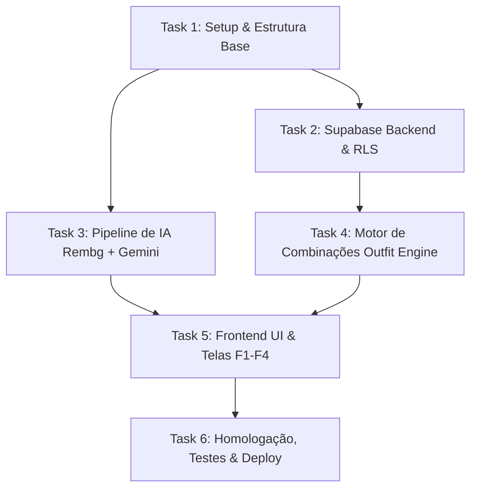

# Roadmap de Tarefas — Guarda-Roupa Consciente (Do Zero ao Deploy)

Este documento define o plano operacional de desenvolvimento do **Guarda-Roupa Consciente** (MVP v1 - ODS 12 / Meta 12.2), estruturado em **6 Tasks modulares**. Cada fase é uma tarefa independente com dependências, entregáveis e critérios de aceite objetivos.

---

## 🗺️ Fluxo de Dependências

---

## 📋 Detalhamento das Tarefas

### 🔹 Task 1: Setup do Ambiente e Estrutura Base
* **Fase:** 1 — Inicialização e Tooling
* **Skill Associada:** [`01-setup-project`](file:///Users/lohancoelho/Antigravity/Guarda%20Roupa%20Virtual/.agents/skills/01-setup-project/SKILL.md)
* **Entregáveis:**
  - [ ] Inicialização do projeto frontend em `frontend/` com React 18 + Vite + TypeScript + CSS Moderno / TailwindCSS.
  - [ ] Instalação de utilitários e ícones (`lucide-react`, `clsx`, `tailwind-merge`).
  - [ ] Criação do ambiente virtual Python em `backend/` com `requirements.txt` (`fastapi`, `uvicorn`, `rembg`, `onnxruntime`, `pillow`, `google-genai`, `python-dotenv`, `python-multipart`).
  - [ ] Criação do `.env.example` e `.env` configurados.
* **Critério de Aceite:** Ambos os servidores rodando localmente sem erros (`npm run dev` no frontend e `uvicorn app.main:app` no backend).

---

### 🔹 Task 2: Modelagem, Migrações e Storage no Supabase
* **Fase:** 2 — Camada de Dados e Segurança
* **Skill Associada:** [`02-supabase-data-layer`](file:///Users/lohancoelho/Antigravity/Guarda%20Roupa%20Virtual/.agents/skills/02-supabase-data-layer/SKILL.md)
* **Entregáveis:**
  - [ ] Criação das tabelas `pecas`, `combinacoes` e `combinacoes_pecas` via script SQL de migração.
  - [ ] Configuração de Row Level Security (RLS) garantindo isolamento total por usuário (`auth.uid()`).
  - [ ] Criação do bucket privado `guarda-roupa` no Supabase Storage e aplicação das storage policies.
  - [ ] Implementação do cliente Supabase e serviço de dados no frontend (`wardrobeService.ts`).
* **Critério de Aceite:** CRUD de peças e criação de registros funcionando com isolamento de segurança ativo.

---

### 🔹 Task 3: Pipeline de IA com Rembg e Google Gemini Flash
* **Fase:** 3 — Processamento de Imagens e Visão Computacional
* **Skill Associada:** [`03-ai-clothing-pipeline`](file:///Users/lohancoelho/Antigravity/Guarda%20Roupa%20Virtual/.agents/skills/03-ai-clothing-pipeline/SKILL.md)
* **Entregáveis:**
  - [ ] Implementação do serviço de remoção de fundo com `rembg` (modelo `u2net_cloth_seg`) e warmup na inicialização.
  - [ ] Implementação da categorização visual gratuita com **Google Gemini 1.5 Flash** utilizando Structured Outputs (Pydantic Schema).
  - [ ] Criação do endpoint FastAPI `/api/process-clothing` que recebe a foto original, remove o fundo, extrai os atributos por IA e devolve o JSON estruturado + imagem sem fundo.
* **Critério de Aceite:** O envio de uma foto de roupa retorna a imagem recortada com transparência e metadados JSON preenchidos em < 5 segundos a custo $0.

---

### 🔹 Task 4: Motor de Combinações e Regras de Harmonia (Outfit Engine)
* **Fase:** 4 — Algoritmo de Estilo e Reuso Consciente
* **Skill Associada:** [`04-outfit-engine`](file:///Users/lohancoelho/Antigravity/Guarda%20Roupa%20Virtual/.agents/skills/04-outfit-engine/SKILL.md)
* **Entregáveis:**
  - [ ] Implementação do algoritmo determinístico de combinação estrutural (Superior + Inferior + Calçado + Sobreposição).
  - [ ] Implementação da matriz de compatibilidade e harmonia cromática.
  - [ ] Implementação da ordenação por menor contagem de uso (`vezes_usada`) para incentivar a rotação de roupas (**ODS 12 - Meta 12.2**).
  - [ ] Filtros por ocasião (casual, trabalho, festa) e estação climática.
  - [ ] Camada opcional de validação (guardrail) via Gemini Flash.
* **Critério de Aceite:** Geração consistente de combinações equilibradas a partir de peças cadastradas.

---

### 🔹 Task 5: Frontend Mobile-First e Telas do MVP (F1 a F4)
* **Fase:** 5 — Interface do Usuário (UI/UX)
* **Skill Associada:** [`05-wardrobe-frontend`](file:///Users/lohancoelho/Antigravity/Guarda%20Roupa%20Virtual/.agents/skills/05-wardrobe-frontend/SKILL.md)
* **Entregáveis:**
  - [ ] **F1 (Cadastro Rápido < 30s):** Modal de captura com câmera/galeria, indicador de progresso e confirmação com 1 clique.
  - [ ] **F2 (Grade do Guarda-Roupa):** Grid de cards com peças sem fundo flutuantes e filtros interativos por categoria, cor e estação.
  - [ ] **F3 (Gerador de Looks):** Canvas dinâmico de composição com botão "Novo Look" e troca de peças.
  - [ ] **F4 (Looks Salvos & Histórico):** Lista de combinações favoritas e registro de uso recente ("Usei hoje").
  - [ ] Layout mobile-first com `BottomNav` e suporte a PWA (`manifest.json`).
* **Critério de Aceite:** Interface responsiva, elegante, rápida e 100% navegável em dispositivos móveis.

---

### 🔹 Task 6: Homologação, Validação do PRD e Deploy Gratuito
* **Fase:** 6 — Publicação e Avaliação do ODS 12
* **Skill Associada:** [`06-deploy-and-ci`](file:///Users/lohancoelho/Antigravity/Guarda%20Roupa%20Virtual/.agents/skills/06-deploy-and-ci/SKILL.md)
* **Entregáveis:**
  - [ ] Deploy do frontend na Vercel ou Netlify com HTTPS.
  - [ ] Configuração do backend FastAPI para o teste piloto (túnel ngrok ou Render Free).
  - [ ] Testes práticos em smartphones reais (iOS / Android).
  - [ ] Validação dos 4 critérios de sucesso do PRD:
    1. Cadastro de peça em < 30 segundos.
    2. Categorização automática por IA sem input manual.
    3. Geração de pelo menos 1 sugestão de combinação viável.
    4. Coleta de feedback qualitativo sobre impacto no consumo consciente (ODS 12).
* **Critério de Aceite:** Aplicação no ar, testada por usuários reais e pronta para o relatório da Atividade Extensionista 4.

---

## 🔑 Contas e Conexões Necessárias

Para desenvolver e publicar o projeto com **custo zero**, você precisará apenas das seguintes contas gratuitas:

| Serviço | Para que serve | O que você precisará fornecer |
|---|---|---|
| **1. GitHub** | Armazenar o repositório de código e disparar o deploy automático na Vercel/Netlify | Repositório git configurado no seu terminal |
| **2. Google AI Studio** | Obter a chave gratuita da API do **Gemini 1.5 Flash** (sem cartão) | `GEMINI_API_KEY` (colada no arquivo `.env`) |
| **3. Supabase (Free Tier)** | Banco de dados PostgreSQL, Autenticação e Storage de fotos | `VITE_SUPABASE_URL` e `VITE_SUPABASE_ANON_KEY` (no `.env`) |
| **4. Vercel ou Netlify** | Hospedagem gratuita da aplicação web com HTTPS e PWA | Conectar com sua conta do GitHub para deploy com 1 clique |
